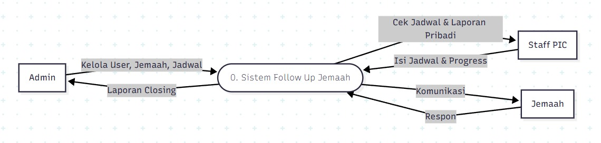
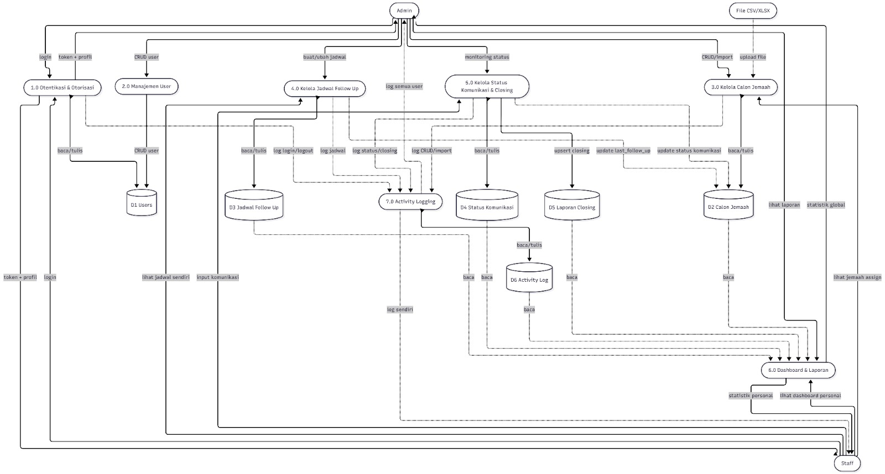

# 🚀 Tugas Besar: Sistem Follow Up Calon Jemaah Umrah

> **Dosen Pengampu:** Muhammad Shiddiq Azis, S.T., MBA

---

## 📊 Data Flow Diagram (DFD)

Diagram berikut menunjukkan alur data dalam sistem follow up jemaah.

### 🔹 DFD Level 0


### 🔹 DFD Level 1

---

## 🎨 Mockup Antarmuka

Rancangan UI aplikasi yang berfokus pada pengalaman pengguna.

| Login Page                 | Dashboard                          | Core Feature                   |
| -------------------------- | ---------------------------------- | ------------------------------ |
|  |  |  |

---

## 🛠️ Stack Teknologi

* **Frontend:** Blade (Laravel) + TailwindCSS
* **Backend:** PHP dengan Laravel Framework
* **Database:** MySQL
* **Deployment:** Railway

---

## ⚙️ Fitur Utama

* 🔐 Autentikasi Login (Admin & Staff)
* 👥 Manajemen Data Calon Jemaah (CRUD)
* 📞 Manajemen Follow Up
* 📊 Dashboard Statistik
* 📈 Laporan Closing & Conversion Rate
* 🔎 Pencarian dan Filter Data

---

## 👤 Role Pengguna

### Admin

* Mengelola data user
* Mengakses semua fitur
* Melihat laporan lengkap

### Staff

* Menginput data calon jemaah
* Melakukan follow up
* Melihat dashboard

---


## 💻 Cara Instalasi (Local)

1. Clone repository:

```bash
git clone [url-repo]
```

2. Masuk ke folder project:

```bash
cd IMPAL1/laravel
```

3. Install dependency:

```bash
composer install
```

4. Copy file environment:

```bash
cp .env.example .env
```

5. Generate key:

```bash
php artisan key:generate
```

6. Atur database di `.env`:

```env
DB_DATABASE=impal1
DB_USERNAME=root
DB_PASSWORD=
```

7. Migrasi database:

```bash
php artisan migrate
```

8. Seed data:

```bash
php artisan db:seed
```

9. Jalankan server:

```bash
php artisan serve
```

10. Buka di browser:

```
http://127.0.0.1:8000
```

---
